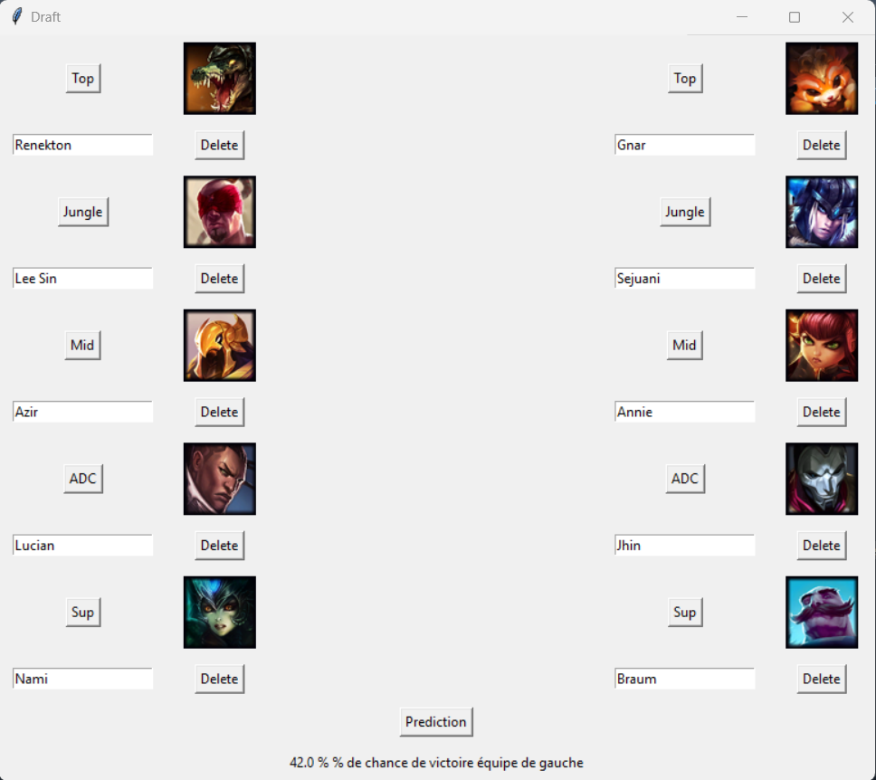

# En cours de création, rédaction et formation du repo

L'objectif de ce projet, est d'analyser les potentialité du deep learning, et plus particulièrement des transformers dans la compréhension des dynamique entre les différents personnages d'un jeu vidéo

Contexte du jeu:
League of legend est un jeu de 5 contre 5 ou l'objectif est de détruire la base ennemie.
Parmis les 150 personnages disponibles, chaque équipe choisit 5 champions de manière a disposer de certaines synergie.
L'analyse cible donc a identifier si les transformers peuvent être un atout pour décrypter ces dynamiques. 
Une des complexité du monde du jeu vidéo et la grande variabilité des règles : Les statistiques et attributs des personnages sont changés par des mise à jour régulière.

Hypothèses fondamentale:
-Les synergies entre les champions sont impactés faiblement par les mises à jour
-La variabilité des styles de jeu suivant le type de joueur impact faiblement ces synergies au niveau professionnel

Data : 
Il s'agit des données de match professionnel sur 10 ans. En particulier les compositions d'équipes, les joueurs ainsi que le résultat de ces matchs.
Il y a donc un équilibre parfait 50/50 pour les victoires défaites. Et un déséquilibre assez important dans la présence de certains champions.

# Analyse:
Masked Language Modeling:
Cette approche permet a partir de ces compositions de prédire avec une fiabilité importante le personnage manquant (top10 accuracy>90%) 
Une visualisation de ces embeddings confirme la présence de role et de classes, qu'ils soient explicité ou non dans la génération des embeddings.
(Soutien, attaquant, ...)
L'ordre de la composition dans la donnée a un impact important sur le rôle du champion. Mais le modèle MLM fait mieux qu'un choix aléatoire parmis la classe similaire.

Prediction:
A partir des embeddings générés précedemment, on cherche à prédire le gagnant selon les compositions uniquement.
Les transformers semblent en difficultés pour apprendre efficacement comparativement aux modèles pleinements connectés.
Les modèles pleinement connectés semble performant (60% en meilleur accuracy, pour une donnée 50/50).

# Interprétation : 

Il existe bel et bien une dynamique de composition qui prévaut sur la qualité du jeu postérieur, sinon un 50% serait attendu. Elle semble non négligeable pour certaines league et certaines années.
Cependant, cela ne garantit pas une victoire pour une meilleure composition que l'adversaire. La qualité des joueurs, les performances du moment et le style de jeu 
rend difficile à évaluer la notion de modèle performant : on ne sait pas objectivement qui aurait du gagner à partir des champions choisit.

En outre, il émergeait que la composition d'équipe jouait un rôle plus important dans la possibilité de prédiction de victoire dans certaines leagues, réputée de plus haut niveau. 
Ce qui laisse à penser que les actions effectués par les joueurs sont plus optimale et respectent mieux les compositions choisient.

Afin de tester l'outil, une interface simple à été mise en place, pour obtenir la prédiction du modèle selon les compositions:

 
